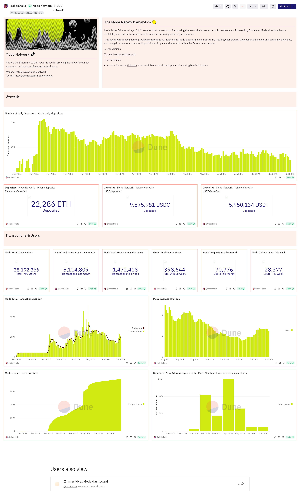

# The Mode Network Analytics 🟡 🔗

## Overview
This dashboard is designed to provide comprehensive insights into Mode's performance metrics. By tracking user growth, transaction efficiency, and economic activities, you can gain a deeper understanding of Mode's impact and potential within the Ethereum ecosystem.

[View the Dashboard](https://dune.com/abdelhaks/mode-network)

## Sections

### I. Transactions
- Analyze transaction volumes and patterns across different networks.

### II. User Metrics (Addresses)
- Track user growth and activity through unique addresses.

### III. Economics
- Examine economic indicators such as transaction costs and other key financial metrics.

## Contributing
- Contributions are welcome! Please open an issue or submit a pull request.

## License
- This project is licensed under the MIT License.
