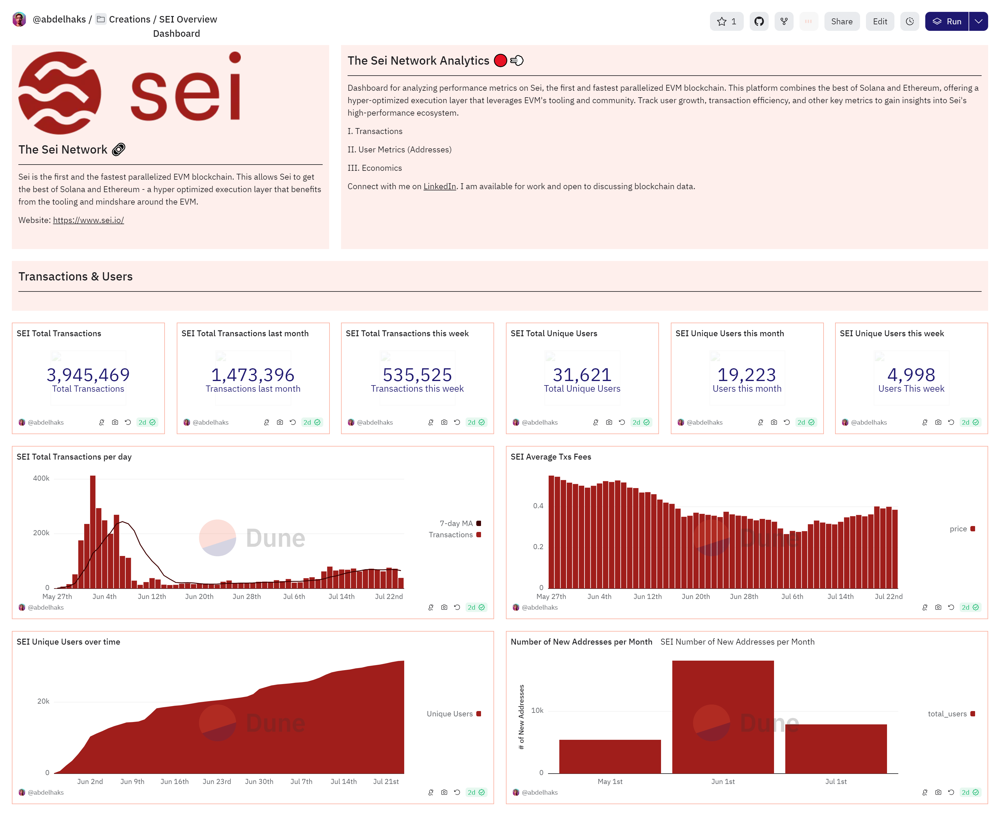

# The Sei Network Analytics 🔴💨 

## Overview
Dashboard for analyzing performance metrics on Sei, the first and fastest parallelized EVM blockchain. This platform combines the best of Solana and Ethereum, offering a hyper-optimized execution layer that leverages EVM's tooling and community. Track user growth, transaction efficiency, and other key metrics to gain insights into Sei's high-performance ecosystem.

[View the Dashboard](https://dune.com/abdelhaks/sei-overview-dashboard)

## Sections

### I. Transactions
- Analyze transaction volumes and patterns across different networks.

### II. User Metrics (Addresses)
- Track user growth and activity through unique addresses.

### III. Economics
- Examine economic indicators such as transaction costs and other key financial metrics.

## Contributing
- Contributions are welcome! Please open an issue or submit a pull request.

## License
- This project is licensed under the MIT License.
